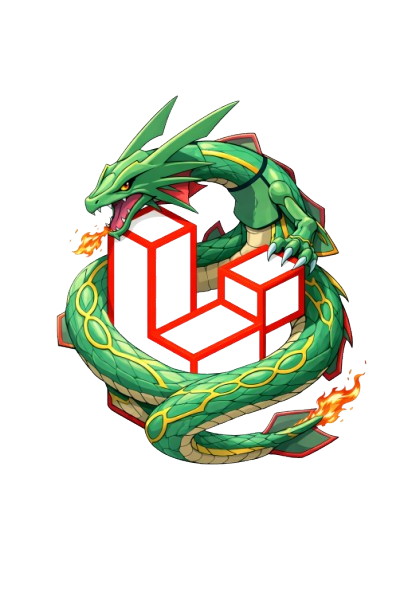

<p align="center">
  
</p>

# Laradex  
### Pokédex Laravel avec gestion des formes & créateur d'équipes
Laradex est une application web développée avec **Laravel** permettant de :

- Suivre les Pokémon débloqués dans un Pokédex personnel
- Gérer les **formes spéciales** (Mega, Gmax, Alola, Galar, Hisui, Paldea, etc.)
- Activer le mode **Shiny**
- Créer et gérer des **équipes de 6 Pokémon**
- Sauvegarder la **forme sélectionnée** dans chaque slot d’équipe

---

# Sommaire

- [Fonctionnalités](#fonctionnalités)
  - [Pokédex Personnel](#pokedex-personnel)
  - [Gestion Shiny](#gestion-shiny)
  - [Gestion des Formes](#gestion-des-formes)
  - [Créateur d’Équipes](#créateur-déquipes)

- [Stack Technique](#stack-technique)

- [Structure du Projet](#structure-du-projet)

- [Schéma de Base de Données](#schéma-de-base-de-données)
  - [users](#users)
  - [pokemons](#pokemons)
  - [pokemon_user](#pokemon_user)
  - [user_teams](#user_teams)
  - [user_team_pokemon](#user_team_pokemon)

- [Prérequis](#prérequis)

- [Installation](#installation)
  - [Cloner le projet](#cloner-le-projet)
  - [Installer les dépendances PHP](#installer-les-dépendances-php)
  - [Installer les dépendances JS](#installer-les-dépendances-js)

- [Configuration de l’environnement](#configuration-de-lenvironnement)
  - [Copier le fichier .env](#copier-le-fichier-env)
  - [Générer la clé](#générer-la-clé)
  - [Modifier le nom de l’application](#modifier-le-nom-de-lapplication)

- [Migration & Seed](#migration--seed)
  - [Migrer](#migrer)
  - [Seeder](#seeder)

- [Lancer le projet](#lancer-le-projet)
  - [Compiler les assets](#compliler-les-assets)
  - [Lancer le serveur](#lancer-le-serveur)

- [Configuration Email (Reset Password)](#configuration-email-reset-password)

- [Utilisation](#utilisation)
  - [Pokédex](#pokédex)
  - [Équipes](#équipes)

- [Dépannage](#dépannage)
    - [Problème-CSRF](#problème-csrf)
    - [Problème-SQLITE](#problème-sqlite)
    - [Problème-Email](#problème-email)

- [Roadmap](#roadmap)

---

# Fonctionnalités

## Pokedex Personnel
- Déblocage des Pokémon par utilisateur
- Pokémon verrouillés affichés différemment
- Déblocage individuel ou en masse
- Filtres avancés :
  - Nom
  - Génération
  - Type
  - Catégories spéciales (Légendaires, Fabuleux, Ultra-Chimères, Paradox)
  - Formes (Mega, Gmax, Alola, Galar, Hisui, Paldea, Autres)

---

## Gestion Shiny
- Bouton Shiny individuel
- Toggle global “Tout en Shiny”
- Sur la page Pokémon : le Shiny respecte la **forme sélectionnée**

---

## Gestion des Formes
Les formes sont stockées dans une colonne JSON `forms`.

Chaque forme peut modifier :
- Sprite normal
- Sprite shiny
- Types
- Stats

Exemples supportés :
- Mega
- Gmax
- Alola
- Galar
- Hisui
- Paldea
- Autres formes spéciales

---

## Créateur d’Équipes
- Création / modification / suppression d’équipes
- 6 slots maximum par équipe
- Possibilité d’utiliser plusieurs fois le même Pokémon
- Sauvegarde de la **forme sélectionnée** dans chaque slot
- Affichage correct des sprites selon la forme choisie

---

# Stack Technique

- **Backend :** Laravel (PHP 8.2+)
- **Frontend :** Blade + CSS personnalisé + JavaScript Vanilla
- **Base de données :** SQLite
- **Authentification :** Laravel Auth
- **Build :** Vite

---

# Structure du Projet

```bash
Laravel-Pokedex/
├── app/
│   ├── Http/
│   │   └── Controllers/
│   │       ├── PokemonController.php          # Home + Pokédex + page show
│   │       ├── UserPokemonController.php      # Déblocage (unlock) des Pokémon
│   │       └── TeamController.php             # CRUD teams + slots (1..6) + pick mode
│   └── Models/
│       ├── Pokemon.php                        # Modèle Pokémon (+ forms JSON)
│       ├── User.php                           # User + relations (pokemons, teams)
│       └── UserTeam.php                       # Team d'un utilisateur
│
├── database/
│   ├── migrations/
│   │   ├── create_pokemons_table.php          # Table pokemons
│   │   ├── create_pokemon_user_table.php      # Pivot unlock: pokemon_user
│   │   ├── create_user_teams_table.php        # Table user_teams
│   │   └── create_user_team_pokemon_table.php # Pivot team: user_team_pokemon (slot + form)
│   │
│   ├── seeders/
│   │   ├── DatabaseSeeder.php                 # Seeder principal
│   │   └── PokemonSeeder.php                  # Import Pokémon depuis JSON
│   │
│   ├── database.sqlite                        # Base SQLite (dev)
│   └── pokemon.json                           # Source des données Pokémon / formes
│
├── resources/
│   ├── views/
│   │   ├── home.blade.php                     # Landing (background animé)
│   │   ├── index.blade.php                    # Pokédex + filtres + unlock
│   │   ├── show.blade.php                     # Détails Pokémon + formes + shiny + nav
│   │   ├── teams.blade.php                    # Liste des teams
│   │   ├── team-create.blade.php              # Création team
│   │   ├── team-edit.blade.php                # Edition team + slots
│   │   ├── layouts/
│   │   │   └── app.blade.php                  # Layout global
│   │   └── auth/
│   │       ├── login.blade.php                # Connexion
│   │       ├── register.blade.php             # Inscription
│   │       ├── verify.blade.php               # Vérification email
│   │       ├── confirm.blade.php              # Confirmation password
│   │       ├── email.blade.php                # Forgot password
│   │       └── reset.blade.php                # Reset password
│   │
│   ├── css/
│   │   ├── app.css                            # Global UI
│   │   ├── home.css                           # Landing animation
│   │   ├── pokemons.css                       # Pokédex
│   │   ├── pokemon-show.css                   # Page show
│   │   ├── teams.css                          # Teams pages
│   │   └── auth.css                           # Auth pages
│   │
│   └── js/
│       ├── app.js                             # JS global
│       ├── pokemons.js                        # Unlock + shiny + actions Pokédex
│       └── pokemon-show.js                    # Variants + shiny toggle + stats
│
├── routes/
│   └── web.php                                # Routes web (pokemons, teams, auth)
│
├── public/
│   └── images/
│       ├── default/                           # Sprites normal
│       ├── shiny/                             # Sprites shiny
│       └── logo.png                           # Logo Laradex (README + mails)
│
└── README.md
```
---

# Schéma de Base de Données

## users
Table par défaut Laravel.

## pokemons
Contient :
- nom
- slug
- numéro Pokédex
- génération
- types
- stats
- images
- forms (JSON)

## pokemon_user
Pivot pour les Pokémon débloqués par utilisateur.

## user_teams
Contient :
- user_id
- name

## user_team_pokemon
Pivot des équipes :
- user_team_id
- pokemon_id
- slot (1 à 6)
- form (ex: normal, mega, gmax…)

Un slot est unique par équipe.  
Un même Pokémon peut être utilisé plusieurs fois.

---

# Prérequis

- PHP 8.1+ (8.2 recommandé)
- Composer
- Node.js + npm
- SQLite activé
- Git

---

# Installation

## Cloner le projet

```bash
git clone https://github.com/BouchardMehdi/Laravel-Pokedex.git
cd Laravel-Pokedex
```

## Installer les dépendances php

```bash
composer install
```

## Installer les dépendances JS

```bash
npm install
```

# Configuration de l'environnement

## Copier le fichier .env

```bash
APP_NAME=Laradex
APP_ENV=local
APP_KEY=base64:8R5CdC1FBKsAF0nHdcTdIQbsew5fQOScGDvdngj0G0E=
APP_DEBUG=true
APP_URL=http://localhost:8000

APP_LOCALE=en
APP_FALLBACK_LOCALE=en
APP_FAKER_LOCALE=en_US

APP_MAINTENANCE_DRIVER=file
# APP_MAINTENANCE_STORE=database

# PHP_CLI_SERVER_WORKERS=4

BCRYPT_ROUNDS=12

LOG_CHANNEL=stack
LOG_STACK=single
LOG_DEPRECATIONS_CHANNEL=null
LOG_LEVEL=debug

DB_CONNECTION=sqlite

SESSION_DRIVER=database
SESSION_LIFETIME=120
SESSION_ENCRYPT=false
SESSION_PATH=/
SESSION_DOMAIN=null

BROADCAST_CONNECTION=log
FILESYSTEM_DISK=local
QUEUE_CONNECTION=database

CACHE_STORE=database
# CACHE_PREFIX=

MEMCACHED_HOST=127.0.0.1

REDIS_CLIENT=phpredis
REDIS_HOST=127.0.0.1
REDIS_PASSWORD=null
REDIS_PORT=6379

MAIL_MAILER=smtp
MAIL_HOST=sandbox.smtp.mailtrap.io
MAIL_PORT=2525
MAIL_USERNAME=VOTRE_USERNAME
MAIL_PASSWORD=VOTRE_PASSWORD
MAIL_ENCRYPTION=tls
MAIL_FROM_ADDRESS="no-reply@laradex.test"
MAIL_FROM_NAME="Laradex"

AWS_ACCESS_KEY_ID=
AWS_SECRET_ACCESS_KEY=
AWS_DEFAULT_REGION=us-east-1
AWS_BUCKET=
AWS_USE_PATH_STYLE_ENDPOINT=false

VITE_APP_NAME="${APP_NAME}"

```

## Générer la clé

```bash
php artisan key:generate
```

## Modifier le nom de l'application

dans .enc :

```bash
APP_NAME="Laradex"
```

# Migration & Seed

## Migrer

```bash
php artisan migrate:fresh
```

## Seeder

```bash
php artisan db:seed
```

# Lancer le projet

## Compliler les assets

```bash
npm run dev
```

## Lancer le serveur 

```bash
php artisan serve
```

### ouvrir

```bash
[php artisan serve](http://127.0.0.1:8000)
```

# Configuration Email (Reset Password)

En développement utiliser **Mailtrap**

## Exemple .env :

```bash
MAIL_MAILER=smtp
MAIL_HOST=sandbox.smtp.mailtrap.io
MAIL_PORT=2525
MAIL_USERNAME=VOTRE_USERNAME
MAIL_PASSWORD=VOTRE_PASSWORD
MAIL_ENCRYPTION=tls
MAIL_FROM_ADDRESS="no-reply@laradex.test"
MAIL_FROM_NAME="Laradex"
```

puis :

```bash
php artisan config:clear
php artisan cache:clear
```

Mailtrap est pour le développement uniquement.
En production, utiliser SMTP d'un hébergeur ou un service comme Brevo.

# Utilisation

## Pokédex

- Débloquer des Pokémon
- Filtrer par génération / type / forme
- Activer le mode Shiny

## Équipes

- Créer une équipe
- Modifier les slots
- Ajouter via :
    - Pokédex
    - Page détail Pokémon
- La forme sélectionnée est sauvegardée

# Dépannage

## Problème CSRF

```bash
php artisan config:clear
php artisan cache:clear
```

## Problème SQLite

- Vérifier que database.sqlite existe
- Vérifier .env

## Problème Email

- Vérifier identifiants Mailtrap
- Vider le cache config

# Roadmap

- Drag & drop des Pokémon dans les équipes
- Analyse des couvertures de types
- API REST
- Partage public d’équipes
- Profils utilisateurs publics
